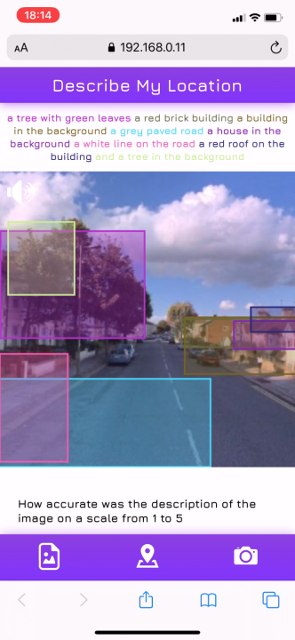
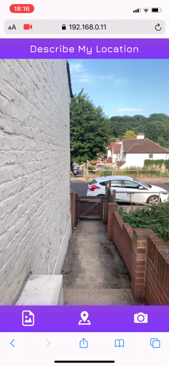
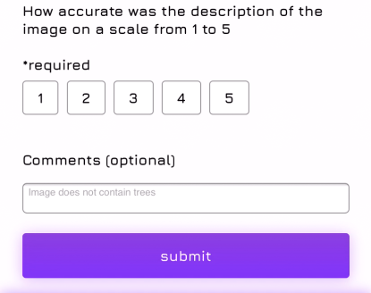

# Michael-Newcombe-Visual-Aid-Mobile-App-Describe-My-Location-

## A Mobile Web App For The Visually Impaired

### Overview

Describe My Location is a mobile web app developed using the web framework Flask. The app is designed to aid people who are visually impaired when they walking along a street, by describing their physical surroundings using a computer vision and machine learning technique called image captioning. This is where a computer tries to describe an image in a natural language. The difference between this app and other visual aid apps that make use of image captioning is that Describe My Location does not require the user to take a picture of their surroundings using their device's camera instead, it uses a street view image based on the user's current geographical location as a reference for the user's surroundings. The street view image is then passed into a pre-trained image captioning model which generates a text description for the image. The text description is then passed into a text to speech system so that the text can be outputted to the user as speech.

**Video demo:** https://vimeo.com/427505795

**Original repo** https://gitlab.doc.gold.ac.uk/mnewc002/computer-vision-and-machine-learning

### App Specifications

**Image Captioning**

The app uses by a pre-train machine learning model called DenseCap which is developed in Lua using the framework Torch. DenseCap is used for image captioning and works by generating text descriptions for the different objects it detects within an image which is referred to as dense captioning. This is different from how standard image captioning models work as they instead try to do describe an image in one sentence. The paper regarding the model DenseCap and the term dense captioning can be found, [here](https://cs.stanford.edu/people/karpathy/densecap/).
 
**Street View Images**

The street view images the app uses as a reference for the user's surroundings is, based on the user's current location this works, by retrieving the device's geolocation coordinates. As well as the user's location, the direction that the user is facing is also retrieved, by accessing the device's orientation properties. This data is, then passed into the Bing™ Maps REST Services API which is, used to download the street view image for the user's current location. Documentation on this API can be found, [here](https://docs.microsoft.com/en-us/bingmaps/rest-services/).

**Camera**

In case the app is unable to retrieve a street view image for the user's current location, the user can instead take a picture of their surroundings using their device's camera.

**File upload**

The app also gives the user the option to get descriptions for images saved on their device using the file upload feature. 

**User Feeback**

Users can also leave feedback on how accurate the descriptions generated by the app for a given image were. This information is, then stored in a MySQL database. 

**Prerequisites**

Required: DenseCap, Python 3, Flask 1.1.1, flask-wtf, pyOpenSSL, wtforms, NumPy

Optional: MySQL, PyMySQL
